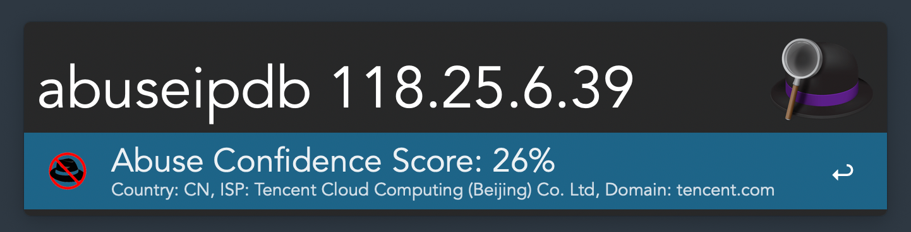
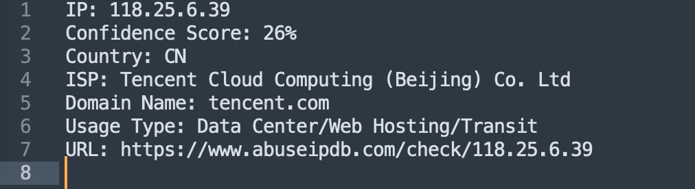
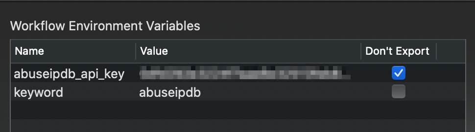
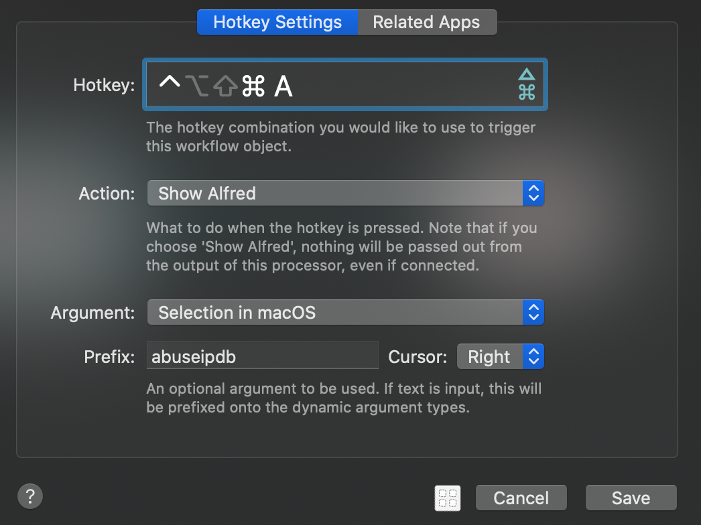
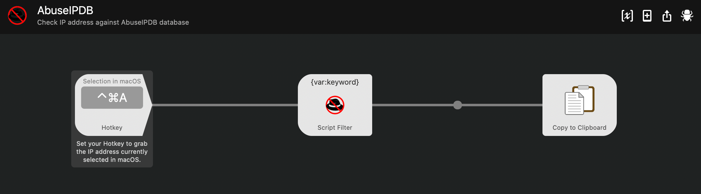
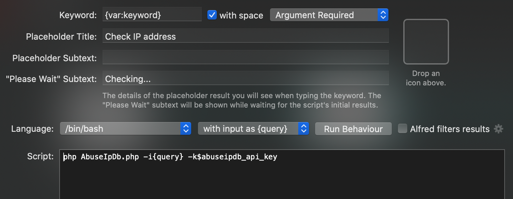

# AbuseIPDB Workflow for [Alfred](http://www.alfredapp.com/)

This workflow queries AbuseIPDB API and returns result for specified IP address. The keyword is `abuseipdb` (example `abuseipdb 118.25.6.39`). The keyword can be configured so select the one that suits you.

With <kbd>↩</kbd> you can copy the details to the clipboard and then paste into any app.

Please star this repo if you find the workflow useful :)

## Installation

Download and open the workflow file. Alfred should handle installation from here. You can download the workflow from Releases page.

## Configuration

### AbuseIPDB API key

You would need to register for [AbuseIPDB API](https://docs.abuseipdb.com/) and get an API key. Then configure it in the [Workflow Environment Variables](https://www.alfredapp.com/help/workflows/advanced/variables/) section under `abuseipdb_api_key`.

### Keyword

You can also configure a keyword under `keyword` variable.

## Usage

### Manual query

You may open alfred and manually enter the keyword and the IP address.

### Query from selection

Or you can assign a hotkey to query selected IP address.

By default, <kbd>Cmd + Ctrl + A</kbd> is set as a hotkey. You would also need to update the prefix if you changed the keyword. Then select the IP address and use your assigned hotkey to trigger Alfred to query this IP address against AbuseIPDB database. 

## Additional Information

### Alfred Workflow Diagram

### Script Filter

